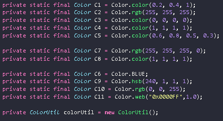
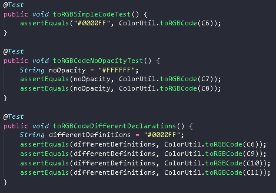
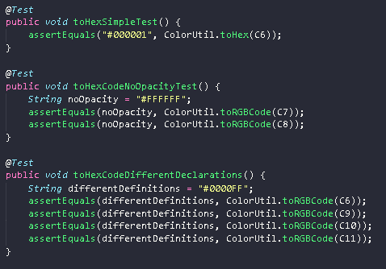

## <a>Introdução</a>

Visando a organização do projeto, este documento disponibiliza uma tabela de cobertura de Condições/Decisões do arquivo "ColorUtil.java" responsável por padronizar a formatação das cores do projeto JabRef.

## <a>Tabela de Decisões/Condições</a>

| Decisão | Condição | Situação para True | Situação para False |
| :--: |-- | -- |:--:|
| 01 | Formatação da variável de entrada "color"| Descrita como RGB ou Hex | Descrita de qualquer outro modo |
| 02 | Variável "color" estar no formato RGB (%d,%d,%d,%f) | Opacidade definida | Opacidade não definida |
| 02 | Variável "color" estar no formato RGB (#%02X%02X%02X)  | Opacidade não definida | Opacidade definida |
| 03 | Variável "color" estar no formato HEX | Necessariamente deve estar apresentada com uma # inicial e uma sequencia de 6 dígitos hexadecimais | Qualquer outra formatação |

## <a>Variáveis</a>

Essas foram as variáveis criadas para serem utilizadas durante os processos de testes, pois também deveríamos testar diferentes meios de declaração de variáveis no funcionamento do programa.

 

## <a>Testes Elaborados</a>

Essas foram os testes criados para cobrir todos os casos de tomadas de decisões, e os casos especiais quando uma cor apresenta opacidade 0 (transparente), e quando são declaradas variáveis de maneiras diferentes que o habitual (Color.rgb, Color.hsb, Color.web, etc).
 

 

